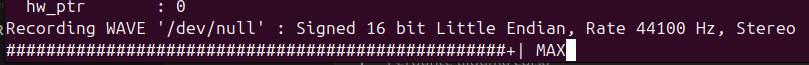

# Harpia-server

## Uma rede colaborativa de estações EOP-IoT.
O Harpia Server é uma rede de estações de observação de pássaros IoT que transmitem em tempo real imagens de pássaros de diversas localidades. Qualquer pessoa pode adquirir e instalar uma estação em sua localidade, bastando fornecer alimento adequado para pássaros como atrativo e uma conexão com a internet através de Wi-Fi ou cabo. As estações são portáteis e podem ser fixadas em árvores, bases ou edificações. Cada estação tem capacidade para fornecer imagens de alta resolução que permitem observar cores, detalhes, canto e padrões, seja para a apreciação ou para a observação técnica da espécie.

O Harpia Server é uma iniciativa que visa conectar admiradores e estudiosos de pássaros como uma rede de alta granularidade e altamente distribuída, melhorando a experiência de observação e viabilizando um contato ainda mais abrangente com a natureza.
## Streaming de Vídeo e Áudio com Ubuntu Server

Este guia completo mostra como configurar uma transmissão de vídeo + áudio usando:


* [FFmpeg - ]()
    Framework multimídia composto por bibliotecas e ferramentas de linha de comando (como ffmpeg, ffprobe e ffplay) para processamento de áudio e vídeo. Suporta codificação, decodificação, mux/demux, transcodificação, filtragem e streaming. Implementa uma ampla gama de codecs (H.264, H.265/HEVC, AAC, Opus, etc.) e protocolos (RTMP, RTP, HLS, DASH), sendo amplamente utilizado em pipelines de mídia e aplicações em tempo real.

* [MediaMTX - ]() Servidor de mídia em tempo real projetado para ingestão, roteamento e distribuição de streams. Suporta múltiplos protocolos de entrada e saída, incluindo RTSP, RTMP, SRT, WebRTC e HLS. Atua como um relay/bridge de baixa latência, permitindo conversão entre protocolos, autenticação, e distribuição simultânea para múltiplos clientes. É frequentemente utilizado em sistemas de vídeo vigilância, broadcasting e pipelines de streaming.

* [Advanced Linux Sound Architecture (ALSA) - ]() Subsistema de áudio do kernel Linux que fornece drivers para dispositivos de som e uma interface de baixo nível para aplicações (via libasound). Suporta reprodução, captura, controle de dispositivos e MIDI. Implementa mecanismos como PCM (Pulse Code Modulation), mixers e controle de hardware, servindo como base para camadas de mais alto nível como PulseAudio e PipeWire.

---

## 1. Pré-requisitos

* Ubuntu Server instalado
* Webcam conectada (/dev/video0)

    Podendo ser identificada utilizando  comando:
    ```bash
    ls /dev/video*
    ```
* Microfone funcional
* Acesso ao terminal

---

## 2. Instalar dependências

```bash
sudo apt update
sudo apt install ffmpeg alsa-utils pulseaudio -y
```
---

## 3. Testar áudio (ESSENCIAL)

### Ver dispositivos de captura
* Listar dispositivos de captura de áudio

```bash
arecord -l
```

### Testar captura do microfone

```bash
arecord -D hw:0,0 -f cd -vv /dev/null
```

Deverá aparecer movimentação (barras)

EX:



### Testar saída de áudio

```bash
speaker-test -c 2
```

---

## 4. Identificar e listar hardware de câmera/imagem

```bash
ls /dev/video*
```

---

## 5. Instalar MediaMTX

### Download

```bash
wget https://github.com/bluenviron/mediamtx/releases/download/v1.6.0/mediamtx_v1.6.0_linux_amd64.tar.gz
```

### Extrair e entrar na pasta

```bash
tar -xzf mediamtx_v1.6.0_linux_amd64.tar.gz
cd mediamtx
```

### Entrar na pasta (se aplicável)

```bash
cd mediamtx
```

 ⚠️ Pode ser que os arquivos são extraídos direto sem pasta, utilize o comando **mkdir** e **mv** para mover os arquivos para dentro do dir criado

EX:
```bash
mkdir -p ~/streaming_video
mv ~/mediamtx ~/mediamtx.yml ~/LICENSE ~/streaming_video/ && cd ~/streaming_video
```
Conferir se os arquivos estão dentro da pasta

---

## 6. Iniciar servidor MediaMTX

Dentro da pasta criada e após extração e instalação do do **MediaMTX**

```bash
./mediamtx
```

Você verá portas abertas:

* RTSP: 8554
* WebRTC: 8889
* HLS: 8888

---

## 7. Iniciar streaming (VÍDEO + ÁUDIO)

Exemplo de configuração de streaming com o ffmpeg:
```bash
ffmpeg \
-f v4l2 -i /dev/video0 \
-f alsa -i hw:0,0 \
-map 0:v -map 1:a \
-vcodec libx264 -preset veryfast -tune zerolatency -pix_fmt yuv420p \
-acodec libopus -ar 48000 -b:a 96k -ac 2 \
-af "volume=5,aresample=async=1:first_pts=0" \
-f rtsp rtsp://localhost:8554/mystream
```

---
## 8. Acessar no navegador
Confirmar o ip do servidor com o comando ```ip a``` e pegar o procurar ```inet inet 192.168.NN.NNN/NN```

```bash
http://SEU_IP:8889/mystream
```

Exemplo:

```bash
http://192.168.NN.NNN:8889/mystream
```

---

## 9. Testar stream via terminal

```bash
ffplay -nodisp rtsp://localhost:8554/mystream
```

---
<br></br>

# ⚠️ Problemas comuns e soluções

### ❌ Áudio não funciona

* Verifique se o microfone está captando:

```bash
arecord -D hw:0,0 -f cd -vv /dev/null
```

* Ajuste níveis de volume e captação:

```bash
alsamixer
```

→ Pressione F4 (Capture)
→ Ative "Capture"
→ Aumentar os volumes

---

### ❌ Sem som no servidor?

* Executar o comando para teste de áudio:
```bash
speaker-test -c 2
```

Se não sair som:

* problema de driver ou saída de áudio

---

### ❌ Erro de timestamp (DTS / backward in time)

Já corrigido com:

```bash
-af "volume=5,aresample=async=1:first_pts=0"
```

---

### ❌ Codec não suportado

Use:

* Vídeo: H264
* Áudio: Opus ou AAC

---

## Observações importantes

* WebRTC exige codecs compatíveis (H264 + Opus recomendado)
* Servidor deve estar rodando antes do FFmpeg
* Porta 8889 deve estar liberada na rede

---

<br></br>

## Resumo dos comandos para rodar o FFMepg e MediaMTX:

MediaMTX
```bash
cd streaming_video
./mediamtx
```

FFMepg
```bash
ffmpeg -f v4l2 -i /dev/video0 -f alsa -i hw:0,0 -map 0:v -map 1:a -vcodec libx264 -preset veryfast -tune zerolatency -pix_fmt yuv420p -acodec libopus -ar 48000 -b:a 96k -ac 2 -af "volume=5,aresample=async=1:first_pts=0" -f rtsp rtsp://localhost:8554/mystream

```


<br></br>
# Autor
